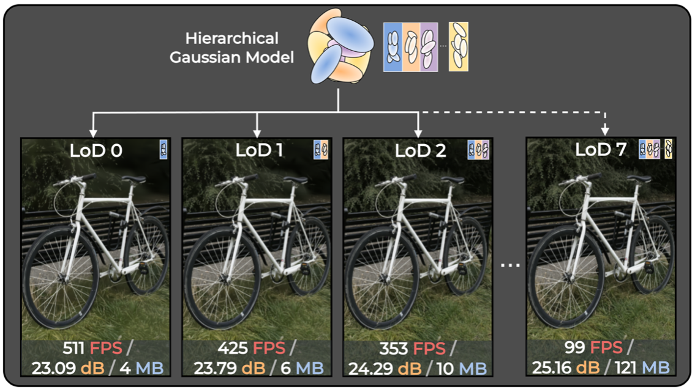
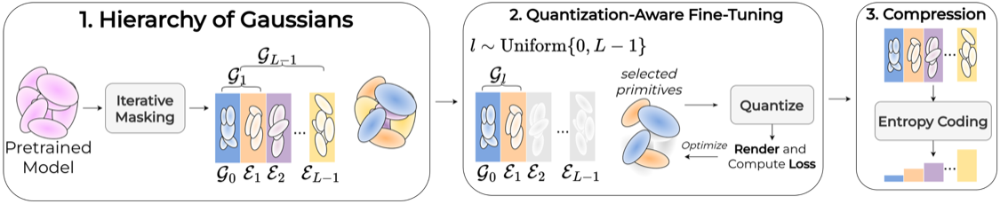

# GoDe: Gaussians on Demand for Progressive Level of Detail and Scalable Compression

[Project Page](https://gaussians-on-demand.github.io/) · [arXiv:2501.13558](https://arxiv.org/abs/2501.13558) · [MIT License](LICENSE)

> **Francesco Di Sario, Riccardo Renzulli, Marco Grangetto, Akihiro Sugimoto, Enzo Tartaglione**
> University of Turin · National Institute of Informatics · Télécom Paris, IPP

---



GoDe is a general framework for **scalable compression and progressive level-of-detail control** of 3D Gaussian Splatting representations. Starting from a single trained model, GoDe reorganizes Gaussian primitives into a fixed progressive hierarchy that supports multiple discrete rate–distortion operating points **without retraining or per-level fine-tuning**.

---

## Method



GoDe operates in three stages after training:
1. **Gradient-informed hierarchical assignment** — iterative masking organizes Gaussians from coarse structure to fine refinements using aggregated gradient sensitivity as an importance criterion.
2. **Single joint fine-tuning** — a quantization-aware fine-tuning stage with random level sampling jointly optimizes all levels in one pass.
3. **Independent per-level compression** — each level is compressed separately using ZSTD with shared dictionaries, enabling scalable progressive decoding with up to **1762× speedup** over prior methods.

---

## Repository Structure

```
├── 3dgs-mcmc/
│   ├── train.py           # Baseline single-level training
│   └── scalable_train.py  # Multi-level GoDe training
└── scaffold-gs/
    ├── train.py           # Baseline single-level training
    └── scalable_train.py  # Multi-level GoDe training
```

---

## Installation

### 1. Clone the repository

```bash
git clone https://github.com/your-username/GoDe.git
cd GoDe
```

### 2. Install backbone dependencies

Each backbone follows its original installation procedure. Please refer to the respective repositories:

- **3DGS-MCMC**: [https://github.com/ubc-vision/3dgs-mcmc](https://github.com/ubc-vision/3dgs-mcmc)
- **Scaffold-GS**: [https://github.com/city-super/Scaffold-GS](https://github.com/city-super/Scaffold-GS)

### 3. Install compression dependencies

```bash
pip install zstandard lzma
```

---

## Datasets

GoDe is evaluated on the standard 3DGS benchmarks:

| Dataset | Link |
|---|---|
| Mip-NeRF 360 | [jonbarron.info/mipnerf360](https://jonbarron.info/mipnerf360) |
| Tanks & Temples | [tanksandtemples.org](https://www.tanksandtemples.org) |
| Deep Blending | [github.com/Phog/DeepBlending](https://github.com/Phog/DeepBlending) |

---

## Usage

### Step 1 — Train the baseline model

Train a standard single-level 3DGS-MCMC model on your scene. This produces the pretrained checkpoint that GoDe will use as its starting point.

```bash
cd 3dgs-mcmc   # or scaffold-gs
python3 train.py \
    -s /path/to/dataset/bicycle \
    -i images_4 \
    -m ./output/nerf_real_360/bicycle \
    --quiet --eval \
    --test_iterations -1 \
    --cap_max 6091454
```

**Arguments:**
- `-s` — path to the scene source directory
- `-i` — image subfolder (e.g. `images_4` for ×4 downscaled images)
- `-m` — output directory for the trained model
- `--cap_max` — maximum number of Gaussians, **3DGS-MCMC only** (scene-dependent)

---

### Step 2 — Multi-level GoDe training

Starting from the pretrained model, GoDe constructs the progressive hierarchy and performs joint fine-tuning across all levels in a single run.

```bash
cd 3dgs-mcmc   # or scaffold-gs
python3 scalable_train.py \
    --eval \
    --G 1 \
    --num_levels 8 \
    --min 100000 \
    --max 0.75 \
    --images images_4 \
    --pretrained_dir ./output/nerf_real_360/bicycle \
    --model_path ./results/nerf_real_360/bicycle/L=8_min=100000_max=0.75_ws=False \
    --source_path /path/to/dataset/bicycle \
    --iterations 30000 \
    --load_iter 30000
```

**Arguments:**
- `--num_levels` — number of LoD levels L (default: 8)
- `--min` — minimum number of Gaussians at LoD 0 (coarsest level)
- `--max` — fraction of total Gaussians at LoD L−1 (finest level)
- `--pretrained_dir` — path to the baseline checkpoint from Step 1
- `--model_path` — output directory for the GoDe multi-level model
- `--G` — upsampling bias for level sampling during fine-tuning; higher values increase the probability of sampling higher LoD levels
- `--iterations` — number of fine-tuning iterations

The output contains **all 8 levels** from a single training run. Each level can be decoded independently at render time.

---

## Citation

```bibtex
@article{di2025gode,
  title   = {GoDe: Gaussians on Demand for Progressive Level of Detail and Scalable Compression},
  author  = {Di Sario, Francesco and Renzulli, Riccardo and Grangetto, Marco
             and Sugimoto, Akihiro and Tartaglione, Enzo},
  journal = {arXiv preprint arXiv:2501.13558},
  year    = {2025}
}
```
